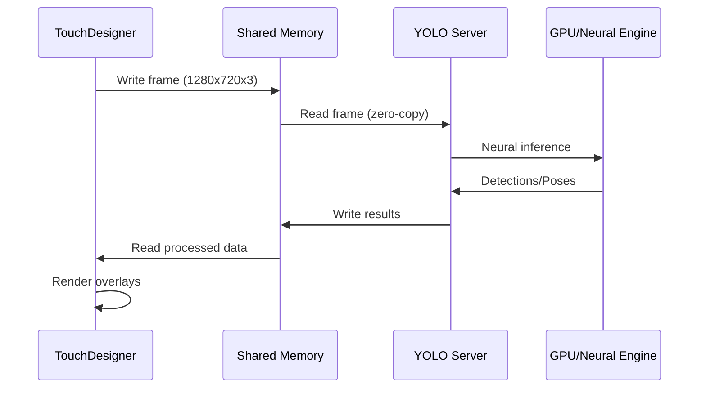

# TD_Yolo - High-Performance YOLO for TouchDesigner

Real-time object detection and pose estimation for TouchDesigner, optimized for interactive installations with zero-copy shared memory architecture.

## 🚀 Features

### Core Capabilities
- **Object Detection**: Real-time bounding box detection with 80+ object classes
- **Pose Estimation**: 17-point COCO skeleton tracking for multiple people
- **YOLO11 Support**: Latest models including yolo11n, yolo11n-pose, yolo11x-pose
- **Zero-Copy Performance**: Shared memory architecture for maximum throughput
- **TouchDesigner Integration**: Native TD components with Script TOP and CHOP nodes

### Performance
- 60+ FPS object detection on modern GPUs
- 30+ FPS pose estimation with multiple people
- < 16ms end-to-end latency
- NVIDIA GPU support via CUDA
- Apple Silicon GPU support via MPS (Metal Performance Shaders)*

*Note: MPS support includes some limitations - half precision and certain operations like grid_sampler (antialiasing) are disabled for compatibility

## 🎯 Quick Start

### Prerequisites
- Python 3.9-3.12 (3.11 recommended, 3.13 has compatibility issues)
- TouchDesigner (2023.11290 or later recommended)
- NVIDIA GPU with CUDA support (optional but recommended)

### Automated Setup (Recommended)

```bash
# Clone and setup
git clone https://github.com/laubsauger/TD_Yolo.git
cd TD_Yolo

# Create virtual environment and install dependencies
# On Windows:
setup.bat
# On macOS/Linux:
./setup.sh

# Or directly with a specific Python version:
python3.11 setup_env.py  # Recommended
python3 setup_env.py     # Uses system default

# For non-interactive setup (e.g., CI/CD):
python3.11 setup_env.py --yes

# Activate the virtual environment
# On Windows:
venv\Scripts\activate
# On macOS/Linux:
source venv/bin/activate

# One-command setup and launch
python setup_all.py -m models/yolo11n-pose.pt

# Custom resolution
python setup_all.py -m models/yolo11n-pose.pt -w 1920 -h 1080
```

The automated setup:
1. Creates Python virtual environment
2. Installs all dependencies (auto-detects GPU)
3. Sets up shared memory segments
4. Launches YOLO server
5. Opens TouchDesigner with the project

### Cross-Platform Commands

All scripts work on Windows, macOS, and Linux:

```bash
# Setup environment (first time only)
python setup_env.py

# Use the all-in-one setup (recommended)
python setup_all.py -m models/yolo11n-pose.pt

# Or run components separately:
# Note: The YOLO server requires shared memory to be created first
# Either TouchDesigner must be running, or use setup_all.py to create it
python start_yolo_server.py models/yolo11n-pose.pt
python launch_touchdesigner.py YoloDetection.toe
```

### Manual Setup

#### 1. Create Virtual Environment
```bash
python -m venv venv

# Activate on Windows:
venv\Scripts\activate

# Activate on macOS/Linux:
source venv/bin/activate
```

#### 2. Install Dependencies

The setup script auto-detects your GPU, but you can install manually:

For NVIDIA GPU (CUDA):
```bash
pip install -r requirements.gpu.txt
```

For CPU or Apple Silicon (MPS GPU):
```bash
pip install -r requirements.cpu.txt
```

For development:
```bash
pip install -r requirements.dev.txt
```

#### 3. Build Cython Extensions
```bash
pip install -e .
```

#### 4. Launch System
```bash
# Start YOLO server
python start_yolo_server.py models/yolo11n-pose.pt

# In another terminal, launch TouchDesigner
python launch_touchdesigner.py YoloDetection.toe
```

## 📊 Architecture



### Shared Memory Layout
- `yolo_states`: 3-byte synchronization flags
- `params`: Detection parameters (thresholds, dimensions)
- `image`: Frame buffer (float32, configurable size)
- `detection_data`: 16KB buffer for bounding boxes
- `pose_data`: 32KB buffer for pose keypoints

## 🎮 TouchDesigner Nodes

### Script TOP (`td_complete.py`)
- Handles frame I/O with shared memory
- Draws bounding boxes and labels
- Configurable detection parameters
- Real-time performance metrics

### Script CHOP (`td_chop_pose.py`)
- Outputs pose keypoints as channels
- 17 keypoints × 3 values (x, y, confidence)
- Per-person tracking
- Smoothing and filtering options

## 🤖 Supported Models

### Object Detection
- `yolo11n.pt` - Nano (fastest, 2.6M params)
- `yolo11s.pt` - Small (balanced)
- `yolo11m.pt` - Medium
- `yolo11l.pt` - Large
- `yolo11x.pt` - Extra Large (best accuracy)
- `yolov8n.pt`, `yolov8x.pt` - Previous generation

### Pose Estimation
- `yolo11n-pose.pt` - Nano pose (fastest)
- `yolo11s-pose.pt` - Small pose
- `yolo11m-pose.pt` - Medium pose
- `yolo11l-pose.pt` - Large pose
- `yolo11x-pose.pt` - Extra large pose
- `yolov8n-pose.pt` - Previous generation

## 🛠️ Advanced Usage

### Custom Video Processing
```bash
python main.py -c models/yolo11n.pt -i input.mp4 -o output.mp4
```

### Quiet Mode (Production)
```bash
python setup_all.py -q -m models/yolo11n-pose.pt  # Suppresses debug output
```

### Stop All Processes
```bash
python setup_all.py --stop
```

### Environment Management
```bash
# Create/recreate virtual environment
python setup_env.py

# Start server with specific venv
python start_yolo_server.py models/yolo11n-pose.pt --venv path/to/venv

# Launch TD without venv setup (uses system Python)
python launch_touchdesigner.py --no-venv
```

## 📐 Configuration

### Detection Parameters (in TouchDesigner)
- **Score Threshold**: Confidence threshold (0.0-1.0)
- **IOU Threshold**: Non-max suppression threshold
- **Max Detections**: Maximum objects to detect
- **Draw Boxes**: Toggle visualization
- **Draw Labels**: Toggle class labels

### Resolution Settings
Default: 1280x720 (16:9)
Pose models: Auto-switches to 640x640
Custom: Use `-w` and `-h` flags

## 💻 GPU Support Details

### NVIDIA CUDA
- Full feature support including half precision (FP16)
- TensorRT optimization available (planned)
- Multi-GPU support
- Tested on: RTX 3090, RTX 4090, A100

### Apple Silicon (MPS)
- Native GPU acceleration via Metal Performance Shaders
- Automatic device detection and configuration
- Limitations automatically handled:
  - Half precision disabled (uses FP32)
  - Antialiasing disabled in image resizing
  - Grid sampler operations use CPU fallback
- Tested on: M1, M2, M3 (Pro/Max/Ultra variants)
- Performance: ~80% of equivalent NVIDIA GPU

### CPU Fallback
- Automatic fallback when no GPU available
- All features supported but slower
- Consider smaller models (nano variants) for CPU

## 🔧 Development

### Project Structure
```
yolo-video-detection-example/
├── models/                 # YOLO model files
├── yolo_models/           # Core processing code
│   ├── detection/         # Detection pipeline
│   ├── processing/        # Model processors
│   └── nms/              # Custom Cython NMS
├── nodes_TD/             # TouchDesigner components
├── setup_all.py          # Automated setup
├── processing.py         # Main server
└── YoloDetection.toe     # TouchDesigner project
```

### Running Tests
```bash
pytest tests/
```

### Linting
```bash
pylint yolo_models
autopep8 --in-place --recursive yolo_models
```

## 🗺️ Roadmap

### Phase 1: ControlNet Integration (Q1 2025)
- [ ] OpenPose JSON export for Stable Diffusion ControlNet
- [ ] Real-time pose to OpenPose format conversion
- [ ] Bone confidence filtering
- [ ] Neck keypoint interpolation from shoulders
- [ ] TouchDesigner to ComfyUI pipeline

### Phase 2: Advanced Tracking (Q2 2025)
- [ ] ByteTrack integration for persistent person IDs
- [ ] Multi-person trajectory smoothing
- [ ] Re-identification after occlusion
- [ ] Track history visualization
- [ ] ID-based event triggers in TD

### Phase 3: Performance Optimization (Q2 2025)
- [ ] TensorRT optimization for NVIDIA GPUs
- [ ] INT8 quantization support
- [ ] Dynamic batching for multiple cameras
- [ ] GPU memory pooling
- [ ] Benchmark suite and profiling tools

### Phase 4: Multi-Camera System (Q3 2025)
- [ ] Synchronized multi-camera capture
- [ ] 3D pose reconstruction from multiple views
- [ ] Camera calibration tools
- [ ] Unified coordinate system
- [ ] Load balancing across GPUs

### Phase 5: Extended Features (Q4 2025)
- [ ] Hand tracking integration
- [ ] Face landmark detection
- [ ] Instance segmentation support
- [ ] Action recognition
- [ ] Custom model training pipeline

## 🤝 Contributing

We welcome contributions! Please see [CONTRIBUTING.md](CONTRIBUTING.md) for guidelines.

### Priority Areas
1. Performance optimizations
2. Additional model support
3. TouchDesigner components
4. Documentation and examples

## 📄 License

This project is licensed under the MIT License - see [LICENSE](LICENSE) for details.

## 🙏 Acknowledgments

- [Ultralytics](https://github.com/ultralytics/ultralytics) for YOLO models
- [TouchDesigner](https://derivative.ca) community
- Original concept and detection implementation by [medvednikov-dn](https://github.com/medvednikov-dn)
- Initial repository structure by [KernelA](https://github.com/KernelA)
- Pose estimation, YOLO11 support, and TD integration by [laubsauger](https://github.com/laubsauger)

## 📞 Support

- **Issues**: [GitHub Issues](https://github.com/laubsauger/TD_Yolo/issues)
- **Discussions**: [GitHub Discussions](https://github.com/laubsauger/TD_Yolo/discussions)
- **Documentation**: See [CLAUDE.md](CLAUDE.md) for development guidance

---

Built for artists, performers, and creative technologists pushing the boundaries of interactive media.
